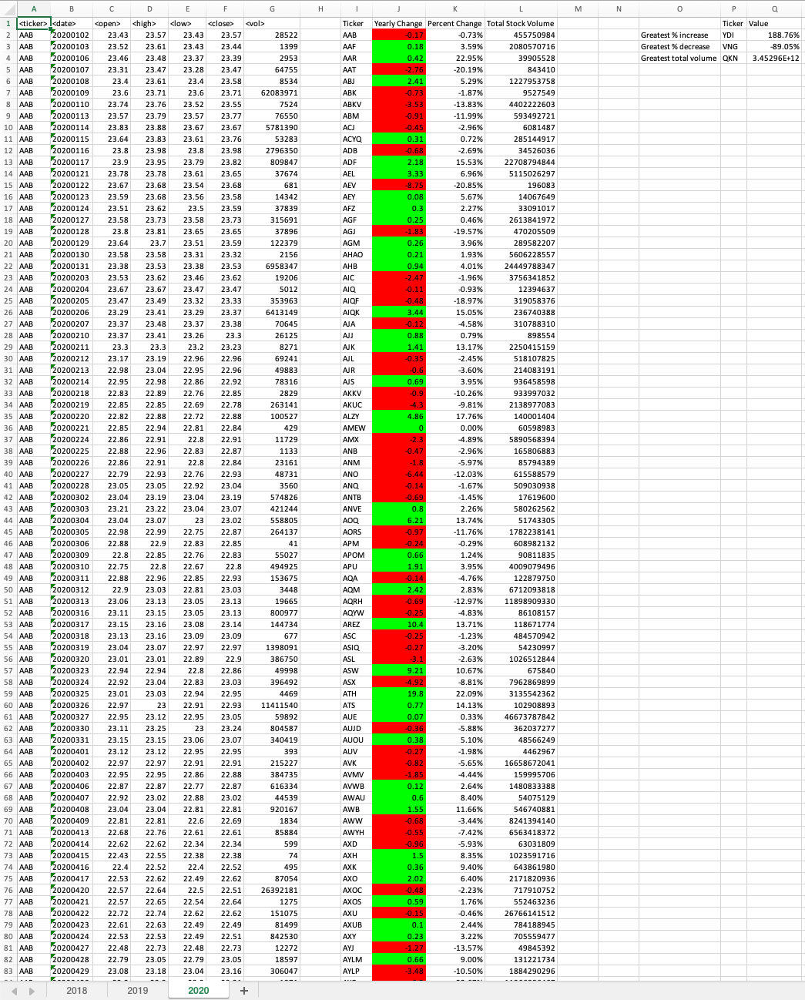

# VBA Challenge (Stock Market Data)

## Background

You are well on your way to becoming a programmer and Excel expert! In this homework assignment, you will use VBA scripting to analyze generated stock market data.

## Solution

The [VBA script](./StockDataAnalysis.vbs) loops through all the stocks for one year and outputs the following information:

- The ticker symbol

- Yearly change from the opening price at the beginning of a given year to the closing price at the end of that year.

- The percentage change from the opening price at the beginning of a given year to the closing price at the end of that year.

- The total stock volume of the stock.

- The stock with the "Greatest % increase", "Greatest % decrease", and "Greatest total volume".

- Conditional formatting highlighting positive change in green and negative change in red.

- Use `AutoFit` method to have the best fit for the content.

### 2018

### 2019

### 2020

